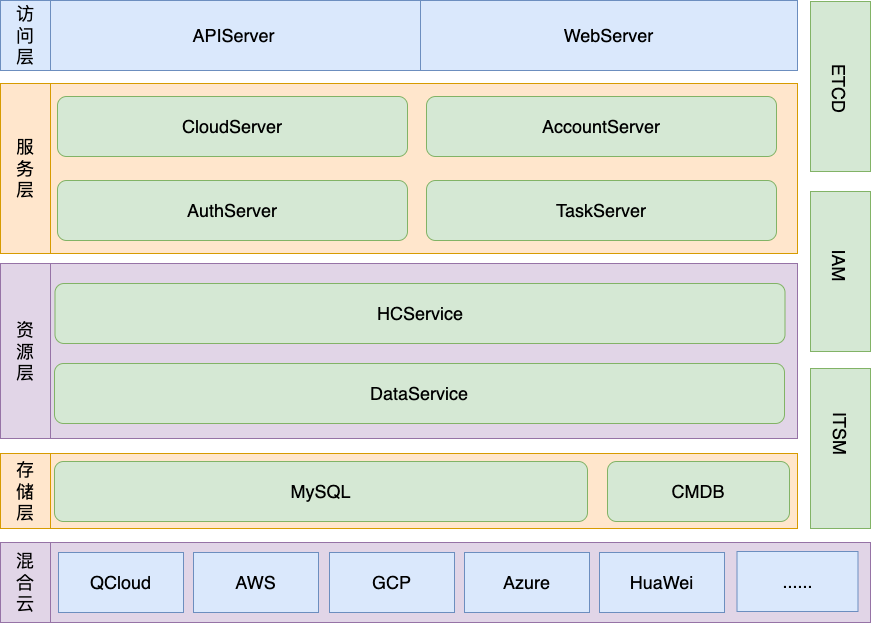

## SPACE-AICOS-HCM介绍

SPACE-AICOS-HCM为业务提供对资源管理层的资源统一纳管与治理能力，同时具备部分PaaS服务的管理能力。在提升资源运营效率的同时，规范资源管理流程，辅助业务提效降本。

本仓库是 SPACE-AICOS-HCM仓库。

## 架构设计

SPACE-AICOS-HCM架构整体为分层的微服务设计，可以分为以下四层：

- 访问层：提供web服务界面和系统的API服务网关；

- 服务层：根据应用场景对资源管理层的原子接口进行封装提供服务；

- 资源层：对资源类型进行抽象和管理，提供原子接口服务；

- 基础设施层：提供系统所需的数据存储、第三方系统调用、服务发现等基础服务。

## 功能特性

一、访问层:

- 核心定位：提供web服务界面和系统的API服务网关。
- 核心组件与能力：
  - web-server: 提供前端专用接口如查询用户、组织架构信息等功能，通过接入层调用系统中提供的API接口
  - api-server: 对外提供统一的API接口服务，将请求转发到服务层

二、服务层
- 核心定位：根据应用场景对资源管理层的原子接口进行封装提供服务，基于操作的相关度分为以下几种微服务。
- 核心能力：
  - cloud-server: 提供云资源相关业务场景操作，包括云资源的增删改查操作和创建异步任务申请云资源等场景，如创建云资源时需要调用cloud-service接口创建云资源，等待云资源创建成功后调用data-service接口写入数据，再调用CMDB的SDK将数据同步过去
  - auth-server: 提供权限相关功能
  - admin-server（系统管理）、task-server（异步任务服务）

三、资源层
- 核心定位：对资源类型进行抽象和管理，提供原子接口服务，划分为以下几种微服务。
- 核心能力
  - data-service: 负责操作DB数据，通过内置的DAO层操作数据，提供云资源数据操作的原子接口
  - hc-service: 负责对接云SDK，提供多云统一的云上资源操作的原子接口，并可以通过data-service将相关数据写入db
  - 待开发服务: event-server（云事件服务）

四、基础设施层
- 核心定位：提供系统所需的数据存储、第三方系统调用、服务发现等基础服务。
- 核心组件
  - MySQL: 数据库用于存储云资源数据
  - ETCD: 服务注册与发现功功能，从而使系统能保持高可用
  - 云: 需要对接多云进行云资源操作，数据均来自云云上。封装多云的云资源操作SDK为统一的SDK，由cloud-service使用对外提供服务
  - 第三方系统调用: 将第三方系统调用封装为SDK提供服务，目前需要对接以下几种第三方系统:
    - APIGateway: 蓝鲸API服务网关，所有第三方API均通过APIGateway进行调用，的前端front也通过APIGateway调用web-server进行用户验证
    - CMDB: 封装CMDB的查询业务、操作云主机等接口为SDK，由cloud-server使用封装场景
    - IAM: 封装IAM的鉴权接口为SDK，由auth-server使用进行鉴权。因为目前IAM无法进行用户认证，所以直接调用auth-server查询权限数据
    - ITSM: 通过可自定义设计的流程模块，覆盖IT服务中的不同管理活动或应用场景帮助企业用户规范内部管理流程，由cloud-server封装调用
    - 网络与协议层：包含协议栈、卡间互联、RDMA 高性能网络技术，为大模型分布式训练、高并发推理提供低延迟、高带宽的网络保障，最大化算力利用率。

## 核心优势
- 多云管理：支持多个公有云的资源管理，如腾讯云、华为云、亚马逊云、微软云、谷歌云等。
- 统一管理模式：统一多云的操作管理，降低用户的云使用门槛，提升业务效率。
- 生命周期管理：云资源的全生命周期管理，如购买、新建、操作配置、回收、销毁、释放等操作。
- 云账号管理：多云账号的纳管和API密钥托管。
- 云资源同步：与云上的资源实时同步。
- IaaS资源管理：对基础设施服务进行管理操作，如主机、硬盘、镜像、VPC、子网、安全组、网络接口、路由表的资源管理操作。
- PaaS资源管理：支持部分PaaS资源的管理，如CLB等。
- 简化权限管理：提供灵活的权限管理方式，屏蔽云上复杂的权限体系。
- 操作审计：用户操作行为的审计与回溯。

## AICOS 社区

中国信通院牵头搭建SPACE AICOS开源社区，旨在汇聚行业各方力量，发挥协同优势与成员单位创新能力，通过关键技术攻关、行业标准制定、生态体系建设等工作，推动AI云操作系统技术创新与产业升级，助力各行业在人工智能驱动下实现数字化转型与高质量发展。

2025 年 6 月，中国信通院联合天翼云、华为、中科院、移动云、摩尔线程、中国铁塔等单位，在全球计算联盟 GCC 下成立 AI 云操作系统专委会。专委会设立了首届主任委员、轮值主任委员及委员，并成立了专委会管理委员会及 7 大专项工作组，包括学术工作组、应用平台工作组、编排调度引擎工作组、推理训练引擎工作组、资源管理引擎工作组、开源生态工作组和标准化工作组，聚焦 AI 云操作系统的核心技术需求与生态建设。

### 社区核心工作方向

- 技术体系建设：围绕AI应用编排、算力调度、资源管理及底层资源适配开展技术研究与落地，打造全栈式AI云操作系统技术体系；
- 专项工作研究：联合学术、应用平台、编排调度、推理训练、资源管理、开源生态、标准化等多方位专家，针对性开展技术与生态建设工作；
- 生态协同发展：联合行业内科研机构、云服务商、运营商、智算中心、硬件厂商等多方主体，推动技术成果落地与产业应用，覆盖能源、金融等多行业领域；
- 标准与人才建设：制定AI云操作系统相关行业标准，推动开源生态建设，同时开展人才培育工作，为行业输送专业技术人才，助力产业创新发展。

### 标准体系建设
SPACE AICOS 联合中国信通院从 AI 云操作系统总体架构、架构各层级及兼容性、安全性、可靠性、关键性能方面规划了完善的标准体系，并逐步启动各项标准的编制工作，旨在为产业发展提供统一的规范和指导。本标准体系已设立19项重要标准，目前《基于 AI 云操作系统的大模型推理加速能力要求》等三项标准已成功立项。

### 贡献指南

欢迎所有开发者参与SPACE AICOS开源社区建设，提交功能特性、修复问题、完善文档。
详细贡献规范请查看 [CONTRIBUTING.md](docs/CONTRIBUTING.md)

### Git Commit 规范

| 标记 | 说明 |
|---|---|
| feat | 新功能/特性开发 |
| fix | 修复存在的 bug |
| docs | 添加/修改文档类内容 |
| style | 修改注释、代码格式化等 |
| refactor | 代码重构、架构调整 |
| perf | 性能优化、参数调优 |
| test | 添加/修改单元测试用例 |
| chore | 构建脚本、CI/CD调整等 |

